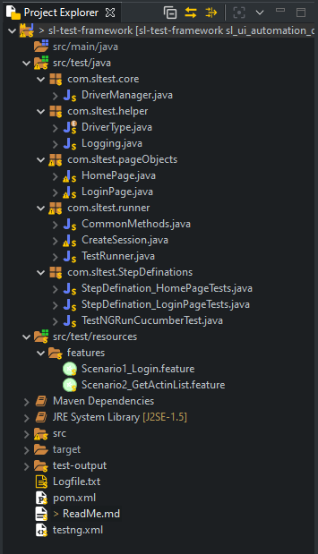

# Stream-line Automation Framework

## Introduction
This project is a framework designed for automating **Strategy-X** application

- Version: 1.0.0

## Environment Set up
You will need below softwares for development
- Eclipse IDE 
- JDK 1.8 -Follow [steps](https://www.oracle.com/java/technologies/javase/javase-jdk8-downloads.html) to install
- [Maven](https://maven.pache.org/install.html)
- Git

## Pre-requisite for project
- TestNG plugin - Follow [steps](https://www.lambdatest.com/blog/how-to-install-testng-in-eclipse-step-by-step-guide/) to install
- Chrome (v87.0)- System chrome version should be v87.If not, update [here](https://support.google.com/chrome/answer/95414?co=GENIE.Platform%3DDesktop&hl=en)
- Cucumber plugin - Follow [steps](https://stackoverflow.com/questions/42399721/run-as-cucumber-feature-not-showing-in-eclipse) to install

*Note: You can install plugins from Eclipse market place*

## Project set up

Follow the below steps to import project 
 - Open eclipse
 - Click on File > import > import
 - Search for "Existing project in Workspace"
 - Select the project folder root path in directory
 - Select the project to import and select "copy project into workspace"
 - Click on "Apply"

## Project Structure



## Building Project

To install dependencies, right click on project > Maven > Update project

To Build project, right click on project > Run as > maven build

## Running Tests

To Build project, right click on project > Run as > maven test

or

Right click on "testng.xml" file, click on "Run as" > TestNG Suite

## Deploy Steps
- Create jar
```
Deployment steps will come here
```

## Reference links
- [Cucumber docs](https://cucumber.io/docs/)


